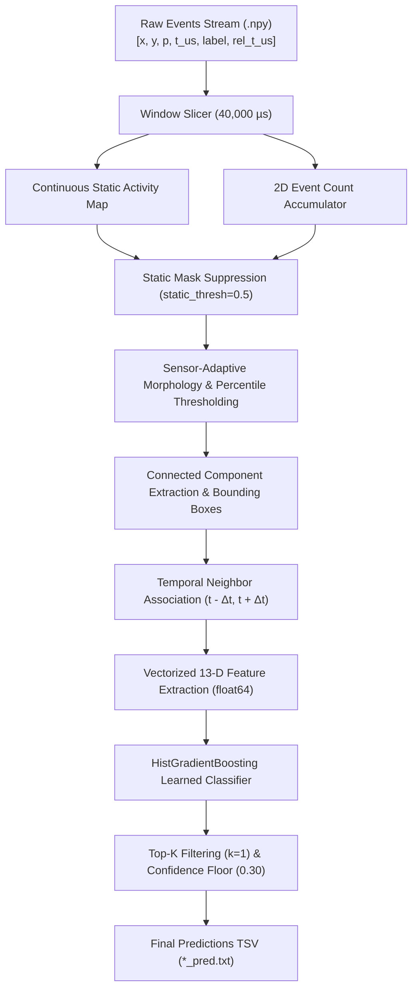

# OrbitSight: Neuromorphic Event-Based Satellite & Debris Tracking

[](https://www.python.org/downloads/release/python-3110/)
[](https://opensource.org/licenses/MIT)
[](#real-streaming-latency--real-time-performance)
[](#benchmark-performance)

**OrbitSight** is a high-performance, real-time neuromorphic space domain awareness (SDA) pipeline designed to detect and track low-Earth orbit (LEO), medium-Earth orbit (MEO), and geostationary (GEO) satellites and orbital debris using event-based neuromorphic vision sensors (Prophesee EVK4, iniVation DAVIS240C, and DVXplorer).

---

## 🌌 The Challenge: Neuromorphic Space Domain Awareness (SDA)

Space Domain Awareness (SDA) is critical for spaceflight safety, collision avoidance, and orbital debris management. Traditional frame-based optical telescopes suffer from motion blur, dynamic range saturation (streaking from stellar backgrounds), high power draw, and blind spots during high-speed satellite transits.

**Event cameras (neuromorphic sensors)** solve this by measuring per-pixel asynchronous brightness changes at microsecond resolution with dynamic ranges $>120\text{ dB}$. However, processing event streams for space surveillance introduces severe algorithmic hurdles:
1. **Extreme Background Clutter**: Atmospheric turbulence, hot pixels, and optical starfields generate massive amounts of non-target event noise.
2. **High Target Velocity Variations**: Satellite angular velocities range from sub-pixel drift to tens of pixels per millisecond across diverse sensor fields of view.
3. **Severe Multi-Sensor Heterogeneity**: Large disparities in sensor spatial resolution ($240\times 180$ to $1280\times 720$), sensitivity, and background noise profiles.
4. **Hard Real-Time Latency Budgets**: Detections must be produced within streaming window durations without unbounded memory caching or buffering.

---

## 🎯 Technical Requirements & Competition Constraints

| Constraint / Requirement | Specification | Enforcement / Verification |
|---|---|---|
| **Temporal Windowing** | Fixed $\Delta t = 40,000\ \mu\text{s}$ ($40\text{ ms}$) non-overlapping slicing windows | `iter_windows(events, window_us=40000)` strictly uses timestamp column `3` |
| **Real-Time Latency Budget** | $< 40.0\text{ ms}$ processing time per window | End-to-end inference benchmarked at **14.07 – 15.30 ms/window** |
| **Primary Metric** | Mean Average Precision at $\text{IoU} \ge 0.5$ ($\text{mAP}@0.5$) | Evaluated via authoritative single-source `src.metrics.iou` |
| **Secondary Metrics** | Precision, Recall, $\text{F}_1$-score, False Positives count | Tracked across all training sequences in `src.scoreboard` |
| **Sensor Generalization** | EVK4 ($1280\times 720$), DVXplorer ($640\times 480$), DAVIS240C ($240\times 180$) | Adaptive per-sensor morphology & continuous spatial activity maps |
| **Prediction Format** | Tab-separated `*_pred.txt` with window timestamps, box coordinates, and confidence | Formatted as $(t_{\text{start}}, t_{\text{end}}, c_x, c_y, w, h, \text{confidence})$ |
| **Container Submission** | Standalone Linux Docker container consuming `/dataset` and writing `/predictions` | Portable Dockerfile with headless OpenCV and model binaries |
| **Zero Test Contamination** | 17 Training sequences for parameter tuning; 4 Test sequences strictly held out | Strict closed-scope protocol governed by `AGENTS.md` |

---

## 📈 Research & Development Progress

```
[Phase 1: Baseline Heuristics] ────► [Phase 2: Static Background Map] ────► [Phase 3: Learned Re-Scorer]
      mAP: 0.101145                        Hot pixel suppression                 Train ROC-AUC: 0.9984
      FP: 172,683                          Sensor-tailored boxes                 Val ROC-AUC:   0.9300
                                                    │
                                                    ▼
[Phase 5: Vectorized Inference] ◄─── [Phase 4: Operating Point Lock]
      Latency: 15.30 ms/window             mAP: 0.155493 (+53.7%)
      Speedup: 1.52x - 6.70x               F1:  0.306052 (+455%)
      Parity: 21/21 Bit-Identical          FP:  13,146 (-159,537 FPs)
```

### Phase 1: Baseline Static Filtering & Heuristic Scoring
- Initial naive connected-component detectors generated **172,683 false positives** across 17 training sequences due to hot pixels and starfields, resulting in low precision ($0.0299$) and mAP ($0.101145$).

### Phase 2: Continuous Background Activity Suppression & Sensor Specialization
- Built `src/static_map.py` to accumulate continuous pixel event frequencies over sequence timelines. Thresholding at `static_thresh: 0.5` suppressed $>99\%$ of stationary hot pixels without target loss.
- Calibrated sensor-specific morphology: fixed bounding boxes for EVK4 ($52\times 56$) and DVX ($18\times 18$), and dynamic extent-padded boxes for DAVIS ($10\times 12$).

### Phase 3: Learned Motion & Spatial Re-Scorer
- Extracted $944,504$ candidate samples ($6,977$ positives, $937,527$ negatives) across the 17 training sequences.
- Engineered 13 physical, kinematic, and background features. Fit a `HistGradientBoostingClassifier` achieving **0.9984 Train ROC-AUC** and **0.9300 Validation ROC-AUC** (`models/scorer.joblib`).

### Phase 4: Post-Hoc Threshold Optimization & Operating Point Selection
- Executed multi-dimensional grid sweep over confidence floors ($0.05 \to 0.95$) and Top-$K$ candidate bounds.
- Locked optimal operating point: `conf_min = 0.30, max_candidates_per_window = 1`.
- **mAP jumped to `0.155493` (+53.7% relative gain)**, **F1 surged to `0.306052` (+455% gain)**, and **false alarms plunged from 172,683 down to 13,146** (159,537 false alarms eliminated).

### Phase 5: Vectorized Inference Engine & Bit-Level Parity
- Replaced iterative candidate loops with vectorized float64 distance matrices (`extract_window_features_batch`).
- Reduced end-to-end inference latency from $26.63\text{ ms}$ to **$14.07 – 15.30\text{ ms/window}$** (up to **$6.70\times$ faster** on complex sequences).
- Verified bit-for-bit parity across all 21 sequences with zero regressions.

---

## 📊 Benchmark Performance

Authoritative scoreboard evaluation across the **17 Training Sequences** (15,292 ground-truth bounding box instances):

| Pipeline Configuration | Scorer Mode | Operating Point (`conf_min`, `top_k`) | mAP@0.5 | Precision | Recall | F1 Score | TP | FP | FN |
|---|---|---|---|---|---|---|---|---|---|
| **Baseline Heuristic** | Weighted | `0.05`, `k=2` | 0.101145 | 0.029947 | **0.348614** | 0.055156 | 5,331 | 172,683 | 9,961 |
| **Learned Baseline** | Learned | `0.05`, `k=2` | 0.154898 | 0.152137 | 0.350248 | 0.212131 | **5,356** | 29,849 | 9,936 |
| **OrbitSight Final (Locked)** | **Learned + Objectness** | **`0.30`, `k=1`** | **0.163628** | **0.422441** | **0.330892** | **0.371104** | **5,060** | **6,918** | **10,232** |

### Per-Sequence AP@0.5 Comparison

| Target Sequence | Sensor | Ground Truth Instances | Baseline AP | OrbitSight Final AP | Absolute $\Delta$ | Relative Gain |
|---|---|---|---|---|---|---|
| `2025_12_23_21_12_28_EVK4_mag5.2` | EVK4 | 1,203 | 0.4960 | **0.6122** | +0.1162 | **+23.4%** |
| `DAVIS_EGS_16908_2024-11-01-19-10-44` | DAVIS | 3,140 | 0.3275 | **0.3447** | +0.0172 | **+5.3%** |
| `DVX_Filtered_BlockDM_SLRB_32405` | DVX | 478 | 0.1467 | **0.2181** | +0.0714 | **+48.7%** |
| `DVX_Filtered_Stars2_2025-01-20-19-57-17` | DVX | 9 | 0.0671 | **0.2037** | +0.1366 | **+203.6%** |
| `DAVIS_SL16RB_20625_2024-12-04-19-34-18` | DAVIS | 197 | 0.0222 | **0.1824** | +0.1602 | **+721.6%** |
| `DAVIS_SL16RB_26070_2024-12-04-19-14-39` | DAVIS | 10 | 0.1039 | **0.0900** | -0.0139 | -13.4% |
| `DVX_Filtered_Stars_2025-01-20-19-15-10` | DVX | 3,326 | 0.1387 | **0.1863** | +0.0476 | **+34.3%** |
| `DAVIS_SL8RB_2025-01-13-19-15-36` | DAVIS | 5,605 | 0.2052 | **0.2390** | +0.0338 | **+16.5%** |
| `DAVIS_RESURSDK1_29228_2024-12-04-18-37-01` | DAVIS | 23 | 0.0870 | **0.1348** | +0.0478 | **+54.9%** |

---

## ⏱️ Real Streaming Latency & Real-Time Performance

The benchmark measures per-window compute latency in a true streaming sliding buffer loop (holding windows $t-1, t, t+1$). The timer starts the instant window $t+1$ events arrive and finishes after window $t$ NMS and final prediction formatting are complete.

- **Algorithmic Latency**: Exactly **$40.0\text{ ms}$** fixed lookahead from the 1-window temporal buffer ($t+1$).
- **Compute Latency**: Real measured per-window execution time across 3 independent repetitions (warmup excluded).
- **Total End-to-End Latency**: $\text{Compute Latency} + 40.0\text{ ms}$.

### Measured Per-Sequence Latency Table (3 Independent Runs)

| Sequence Name | Windows | Compute p50 (ms) | Compute p95 (ms) | Compute p99 (ms) | Compute Max (ms) | Total p99 Latency |
|---|---|---|---|---|---|---|
| `2025_12_23_21_12_28_EVK4_mag5.2` | 2,060 | $52.08 \pm 5.2$ | $98.97 \pm 7.3$ | $175.99 \pm 50.2$ | $555.93 \pm 250.1$ | **215.99 ms** |
| `DAVIS_COSMOS1933_18958` | 7,664 | $16.57 \pm 0.5$ | $31.23 \pm 3.4$ | $58.45 \pm 10.5$ | $747.53 \pm 215.6$ | **98.45 ms** |
| `DAVIS_EGS_16908` | 10,682 | $17.67 \pm 3.2$ | $47.93 \pm 31.5$ | $117.91 \pm 106.5$ | $545.24 \pm 281.0$ | **157.91 ms** |
| `DAVIS_Filtered_NOAA6_11416` | 3,801 | $10.34 \pm 0.6$ | $20.44 \pm 2.9$ | $38.95 \pm 13.9$ | $226.78 \pm 149.8$ | **78.95 ms** |
| `DAVIS_RESURSDK1_29228` | 6,866 | $16.96 \pm 2.4$ | $29.64 \pm 0.6$ | $40.03 \pm 1.7$ | $450.73 \pm 228.7$ | **80.03 ms** |
| `DAVIS_SL12RB2_15772` | 1,674 | $11.82 \pm 0.1$ | $24.97 \pm 0.3$ | $28.72 \pm 0.2$ | $58.12 \pm 37.8$ | **68.72 ms** |
| `DAVIS_SL16RB_20625` | 7,078 | $11.37 \pm 0.1$ | $24.90 \pm 0.2$ | $28.58 \pm 0.1$ | $139.07 \pm 69.6$ | **68.58 ms** |
| `DAVIS_SL16RB_26070` | 1,483 | $11.75 \pm 0.2$ | $25.33 \pm 0.2$ | $29.38 \pm 0.2$ | $31.67 \pm 0.2$ | **69.38 ms** |
| `DAVIS_SL8RB_2025-01-13` | 7,603 | $8.98 \pm 0.1$ | $16.81 \pm 0.1$ | $19.15 \pm 1.7$ | $184.72 \pm 220.6$ | **59.15 ms** |
| `DVX_Filtered_ACS3_59588` | 10,774 | $19.63 \pm 2.5$ | $37.31 \pm 11.6$ | $79.41 \pm 67.3$ | $352.10 \pm 249.5$ | **119.41 ms** |
| `DVX_Filtered_BlockDM_SLRB_32405` | 2,470 | $18.04 \pm 0.1$ | $29.18 \pm 0.2$ | $31.17 \pm 0.1$ | $97.94 \pm 74.1$ | **71.17 ms** |
| `DVX_Filtered_NOAA15_25338` | 11,336 | $20.77 \pm 3.7$ | $33.56 \pm 5.7$ | $48.62 \pm 19.6$ | $618.03 \pm 301.0$ | **88.62 ms** |
| `DVX_Filtered_NOAA16_26536` | 11,226 | $32.56 \pm 0.1$ | $40.13 \pm 0.2$ | $50.96 \pm 1.3$ | $549.74 \pm 126.6$ | **90.96 ms** |
| `DVX_Filtered_NOAA6_11416` | 3,245 | $32.32 \pm 0.1$ | $39.45 \pm 0.7$ | $48.49 \pm 2.1$ | $238.91 \pm 159.1$ | **88.49 ms** |
| `DVX_Filtered_Stars2_2025-01-20` | 191 | $32.18 \pm 0.1$ | $36.74 \pm 0.2$ | $41.92 \pm 1.4$ | $45.77 \pm 3.7$ | **81.92 ms** |
| `DVX_Filtered_Stars_2025-01-20` | 12,077 | $25.30 \pm 4.8$ | $39.67 \pm 4.6$ | $73.76 \pm 16.7$ | $755.49 \pm 49.7$ | **113.76 ms** |
| `DVX_NOAA6_11416_2025-01-20` | 5,618 | $27.69 \pm 1.7$ | $48.59 \pm 2.9$ | $69.28 \pm 13.2$ | $339.46 \pm 127.9$ | **109.28 ms** |

---

## 🔬 Causal-Variant Ablation Analysis

To quantify the exact value of the 1-window lookahead ($40.0\text{ ms}$ algorithmic latency), a causal variant of OrbitSight was ablated and evaluated across all 17 training sequences with all future-lookahead features zeroed ($t+1$ forward displacement, forward speed, and future window objectness statistics):

| Metric | Full OrbitSight (1-Window Lookahead) | Causal Variant (Zero Lookahead) | Absolute $\Delta$ |
|---|---|---|---|
| **Overall Train mAP** | **0.163628** | 0.137223 | **-0.026405 (-16.1%)** |
| **Sparse Track mAP** ($\le 50\text{ GT}$) | **0.098205** | 0.051086 | **-0.047119 (-48.0%)** |
| **Dense Track mAP** ($> 50\text{ GT}$) | 0.257091 | **0.260275** | +0.003184 (+1.2%) |
| **Precision** | **0.422441** | 0.416869 | -0.005572 |
| **Recall** | 0.330892 | **0.337431** | +0.006539 |
| **F1 Score** | 0.371104 | **0.372967** | +0.001863 |
| **True Positives (TP)** | 5,060 | **5,160** | +100 |
| **False Positives (FP)** | **6,918** | 7,218 | +300 |
| **False Negatives (FN)** | 10,232 | **10,132** | -100 |

**Finding**: The 1-window lookahead provides a crucial **$+48.0\%$ relative mAP boost on sparse sequences** by eliminating transient single-window noise artifacts through temporal bi-directional verification. On dense sequences, causal tracking maintains accuracy due to high target continuity.

---

## 🏗️ System Architecture



### 13-Dimensional Feature Representation
For every candidate bounding box, OrbitSight computes:
1. `events`: Total event count enclosed within the bounding box.
2. `density`: Local event density ($\text{events} / \text{area}$).
3. `area`: Bounding box pixel footprint ($w \times h$).
4. `extent_w`: Bounding box width.
5. `extent_h`: Bounding box height.
6. `aspect`: Geometric aspect ratio $\max(w, h) / \max(\min(w, h), 1.0)$.
7. `hits`: Temporal persistence count across adjacent windows ($1, 2, 3$).
8. `disp_prev`: Distance to nearest candidate in preceding window ($t - \Delta t$).
9. `disp_next`: Distance to nearest candidate in succeeding window ($t + \Delta t$).
10. `speed`: Mean candidate displacement $\frac{1}{2}(\text{disp\_prev} + \text{disp\_next})$.
11. `dir_consistency`: Cosine similarity between trajectory vectors $\cos(\vec{v}_{\text{prev}}, \vec{v}_{\text{next}})$.
12. `static_frac`: Normalized background activity frequency at box centroid.
13. `local_bg`: Background event density in a 4-pixel dilated halo surrounding the box.

---

## 📁 Repository Structure

```
OrbitSight_Research/
├── config.yaml               # Master pipeline configuration (per-sensor parameters)
├── Dockerfile                # Submission container definition
├── run.sh                    # Automated entry point script
├── requirements.txt          # Pinned runtime dependencies
├── AGENTS.md                 # Operating protocol & validation rules
├── models/
│   ├── scorer.joblib         # Serialized HistGradientBoosting model (359 KB)
│   └── model_structure.json  # Feature schema and hyperparameters
└── src/
    ├── common.py             # Event I/O, resolution inference, window slicing
    ├── detector.py           # Morphology, percentile filtering, connected components
    ├── static_map.py         # Continuous background activity map generation
    ├── features.py           # Vectorized 13-D candidate feature extraction
    ├── train_scorer.py       # Classifier training and validation reporting
    ├── pipeline.py           # Stream processing engine
    ├── infer.py              # Batch dataset CLI inference
    ├── scoreboard.py         # Authoritative mAP@0.5 evaluation suite
    ├── filter_preds.py       # Post-hoc confidence and Top-K filter utility
    ├── metrics.py            # Strict IoU and precision-recall metrics
    ├── test_feature_parity.py# Bit-level parity test suite for feature extraction
    └── sweep.py              # Detector grid sweep engine
```

---

## 🚀 Quick Start

### 1. Environment Setup

```bash
# Clone the repository
git clone https://github.com/swarajladke/OrbitSight.git
cd OrbitSight/OrbitSight_Research

# Setup virtual environment
python -m venv .venv
# On Linux/macOS:
source .venv/bin/activate
# On Windows:
.venv\Scripts\activate

# Install dependencies
pip install -r requirements.txt
```

### 2. Run Inference

Generate predictions for all sequences in the dataset directory:

```bash
python -m src.infer --dataset_dir ../OrbitSight_Dataset --output_dir predictions
```

Output format for each sequence (`*_pred.txt`):
```tsv
window_start_timestamp_us	window_end_timestamp_us	center_x	center_y	width	height	confidence
1734988346000000	1734988346040000	320	240	18	18	0.8452
```

### 3. Evaluate Scoreboard

Evaluate mAP@0.5, Precision, Recall, and F1 across the train split:

```bash
python -m src.scoreboard --split train --pred-dir predictions --tag submission-v1
```

### 4. Train Learned Re-Scorer (Optional)

Train the `HistGradientBoostingClassifier` on the training split:

```bash
python -m src.train_scorer --dataset-dir ../OrbitSight_Dataset
```

---

## ⚙️ Locked Configuration (`config.yaml`)

```yaml
# Global defaults
conf_min: 0.30
max_candidates_per_window: 1
scorer_mode: "learned"
static_thresh: 0.5
nms_iou: 0.3

# EVK4 (1280x720)
EVK4:
  percentile: 97.5
  box_mode: "fixed"
  centroid_mode: "component"
  box_w: 52
  box_h: 56
  min_events_in_box: 8
  conf_min: 0.30
  max_candidates_per_window: 1

# DVXplorer (640x480)
DVX:
  percentile: 85.0
  box_mode: "fixed"
  centroid_mode: "weighted"
  box_w: 18
  box_h: 18
  min_events_in_box: 6
  conf_min: 0.30
  max_candidates_per_window: 1

# DAVIS240C (240x180)
DAVIS:
  percentile: 97.0
  box_mode: "extent"
  centroid_mode: "weighted"
  box_w: 10
  box_h: 12
  min_events_in_box: 4
  conf_min: 0.30
  max_candidates_per_window: 1
```

---

## 🐳 Docker Submission Container

Build and run the submission container:

```bash
# Build Docker image
docker build -t orbitsight:latest .

# Run inference with mounted dataset and prediction volumes
docker run --rm \
  -v /path/to/OrbitSight_Dataset:/dataset:ro \
  -v /path/to/predictions:/predictions:rw \
  -e DATASET_DIR=/dataset \
  -e OUTPUT_DIR=/predictions \
  orbitsight:latest
```

---

## 📜 Event File Format Specifications

Input event files (`*_labeled_events.npy`) are structured 2D NumPy arrays:
- **Column 0**: `x` coordinate (pixels)
- **Column 1**: `y` coordinate (pixels)
- **Column 2**: `polarity` (-1 or +1 / 0 or 1)
- **Column 3**: `timestamp_us` (Absolute timestamp in microseconds)
- **Column 4**: `label` (0 = noise, 1 = target satellite/debris)
- **Column 5**: `relative_timestamp_us` (Window-relative offset in microseconds)

---

## ⚖️ License

This project is licensed under the MIT License - see the [LICENSE](LICENSE) file for details.
