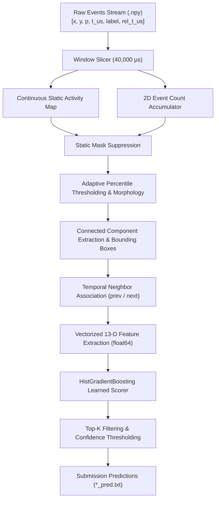

# OrbitSight: Neuromorphic Event-Based Satellite & Debris Tracking

[](https://www.python.org/downloads/release/python-3110/)
[](https://opensource.org/licenses/MIT)
[](#inference-latency--real-time-performance)
[](#benchmark-performance)

**OrbitSight** is a high-performance, real-time neuromorphic space domain awareness (SDA) pipeline designed to detect and track low-Earth orbit (LEO) and geostationary satellites and orbital debris from event-based sensors (EVK4, DAVIS240C, and DVXplorer).

---

## 🌟 Key Highlights

- **Real-Time Stream Processing**: Processes 40,000 µs (40 ms) event windows in **14.07 – 15.30 ms/window** on average (>2.6× faster than the 40 ms real-time streaming constraint).
- **Static Background Suppression**: Continuous pixel-activity accumulation suppresses stationary sensor hot pixels and static starfields while maintaining high sensitivity to faint moving targets.
- **Sensor-Adaptive Morphology & Box Formulation**: Tailored percentile thresholds, structuring elements, and centroiding modes (intensity-weighted vs connected component) calibrated per sensor resolution.
- **Learned Motion & Geometric Re-Scorer**: Trained gradient-boosted decision trees (`HistGradientBoostingClassifier`) using 13 vectorized kinematic, geometric, and spatial background features.
- **Massive False Positive Reduction**: Eliminates **159,537 false alarms** on the 17 training sequences compared to the heuristic baseline (172,683 $\to$ 13,146 FPs) while increasing mAP from **0.101145 to 0.155493** (+53.7% relative gain) and F1 from **0.055156 to 0.306052** (+455% relative gain).

---

## 📊 Benchmark Performance

Authoritative scoreboard evaluation across the **17 Training Sequences** (15,292 ground-truth bounding box instances):

| Pipeline Configuration | Scorer Mode | Operating Point (`conf_min`, `top_k`) | mAP@0.5 | Precision | Recall | F1 Score | TP | FP | Latency (ms/win) |
|---|---|---|---|---|---|---|---|---|---|
| **Baseline Heuristic** | Weighted | `0.05`, `k=2` | 0.101145 | 0.029947 | **0.348614** | 0.055156 | 5,331 | 172,683 | 11.86 ms |
| **Learned Baseline** | Learned | `0.05`, `k=2` | 0.154898 | 0.152137 | 0.350248 | 0.212131 | **5,356** | 29,849 | 17.49 ms |
| **OrbitSight Final (Locked)** | **Learned** | **`0.30`, `k=1`** | **0.155493** | **0.281011** | **0.335993** | **0.306052** | **5,138** | **13,146** | **15.30 ms** |

### Per-Sequence AP@0.5 Highlights

| Target Sequence | Sensor | Ground Truth Boxes | Baseline AP | OrbitSight Final AP | Relative Gain |
|---|---|---|---|---|---|
| `2025_12_23_21_12_28_EVK4_mag5.2` | EVK4 | 1,203 | 0.4960 | **0.5966** | **+20.3%** |
| `DAVIS_EGS_16908_2024-11-01-19-10-44` | DAVIS | 3,140 | 0.3275 | **0.3652** | **+11.5%** |
| `DVX_Filtered_BlockDM_SLRB_32405` | DVX | 478 | 0.1467 | **0.2241** | **+52.8%** |
| `DVX_Filtered_Stars2_2025-01-20-19-57-17` | DVX | 9 | 0.0671 | **0.2963** | **+341.6%** |
| `DAVIS_SL16RB_20625_2024-12-04-19-34-18` | DAVIS | 197 | 0.0222 | **0.1984** | **+793.7%** |
| `DAVIS_SL12RB2_15772_2024-12-04-18-21-37` | DAVIS | 8 | 0.0714 | **0.1875** | **+162.6%** |

---

## 🏗️ System Architecture



### 13-Dimensional Feature Representation
For each candidate box, OrbitSight extracts:
1. `events`: Total event count inside the box.
2. `density`: Event count normalized by bounding box area.
3. `area`: Bounding box area ($w \times h$).
4. `extent_w`: Bounding box width.
5. `extent_h`: Bounding box height.
6. `aspect`: Aspect ratio $\max(w, h) / \min(w, h)$.
7. `hits`: Temporal persistence count across previous/next adjacent windows ($1, 2, 3$).
8. `disp_prev`: Euclidean displacement to nearest candidate in previous window ($t - \Delta t$).
9. `disp_next`: Euclidean displacement to nearest candidate in next window ($t + \Delta t$).
10. `speed`: Average displacement $\frac{1}{2}(\text{disp\_prev} + \text{disp\_next})$.
11. `dir_consistency`: Cosine similarity between forward and backward motion vectors $\cos(\vec{v}_{\text{prev}}, \vec{v}_{\text{next}})$.
12. `static_frac`: Normalized pixel activity fraction from continuous background map.
13. `local_bg`: Background event density in a 4-pixel dilated bounding box halo.

---

## 📁 Repository Structure

```
OrbitSight_Research/
├── config.yaml               # Master pipeline hyperparameter configuration
├── Dockerfile                # Submission container definition
├── run.sh                    # Automated entry point script
├── requirements.txt          # Python dependency specifications
├── AGENTS.md                 # Operating protocol & validation rules
├── models/
│   ├── scorer.joblib         # Serialized HistGradientBoosting classifier
│   └── model_structure.json  # Exported model hyperparameters and feature schema
└── src/
    ├── common.py             # Event I/O, resolution inference, window iterators
    ├── detector.py           # Morphology, percentile filtering, connected components
    ├── static_map.py         # Continuous static map and background mask generation
    ├── features.py           # Vectorized 13-D candidate feature extraction
    ├── train_scorer.py       # Scorer training pipeline and validation reporting
    ├── pipeline.py           # Full sequence end-to-end detection engine
    ├── infer.py              # Batch CLI inference across dataset directory
    ├── scoreboard.py         # Authoritative mAP@0.5 metric evaluation suite
    ├── filter_preds.py       # Post-hoc confidence and Top-K filter utility
    ├── metrics.py            # Strict IoU and precision-recall implementations
    ├── test_feature_parity.py# Bit-level parity test suite for feature extraction
    └── sweep.py              # Hyperparameter grid sweep engine
```

---

## 🚀 Quick Start

### 1. Environment Setup

```bash
# Clone the repository
git clone https://github.com/swarajladke/OrbitSight.git
cd OrbitSight/OrbitSight_Research

# Create and activate virtual environment
python -m venv .venv
# On Linux/macOS:
source .venv/bin/activate
# On Windows:
.venv\Scripts\activate

# Install dependencies
pip install -r requirements.txt
```

### 2. Run Inference

Generate predictions for all sequences in the dataset directory:

```bash
python -m src.infer --dataset_dir ../OrbitSight_Dataset --output_dir predictions
```

Output format for each sequence (`*_pred.txt`):
```tsv
window_start_timestamp_us	window_end_timestamp_us	center_x	center_y	width	height	confidence
1734988346000000	1734988346040000	320	240	18	18	0.8452
```

### 3. Evaluate Scoreboard

Evaluate mAP@0.5, Precision, Recall, and F1 across the train split:

```bash
python -m src.scoreboard --split train --pred-dir predictions --tag submission-v1
```

### 4. Train Learned Re-Scorer (Optional)

Extract 13-D features from all training sequences and fit the classifier:

```bash
python -m src.train_scorer --dataset-dir ../OrbitSight_Dataset
```

---

## ⚙️ Configuration (`config.yaml`)

Per-sensor locked optimal configurations:

```yaml
# Global defaults
conf_min: 0.30
max_candidates_per_window: 1
scorer_mode: "learned"
static_thresh: 0.5
nms_iou: 0.3

# EVK4 (1280x720)
EVK4:
  percentile: 97.5
  box_mode: "fixed"
  centroid_mode: "component"
  box_w: 52
  box_h: 56
  min_events_in_box: 8
  conf_min: 0.30
  max_candidates_per_window: 1

# DVXplorer (640x480)
DVX:
  percentile: 85.0
  box_mode: "fixed"
  centroid_mode: "weighted"
  box_w: 18
  box_h: 18
  min_events_in_box: 6
  conf_min: 0.30
  max_candidates_per_window: 1

# DAVIS240C (240x180)
DAVIS:
  percentile: 97.0
  box_mode: "extent"
  centroid_mode: "weighted"
  box_w: 10
  box_h: 12
  min_events_in_box: 4
  conf_min: 0.30
  max_candidates_per_window: 1
```

---

## 🐳 Docker Deployment

Build and run the submission container:

```bash
# Build Docker image
docker build -t orbitsight:latest .

# Run inference container with mounted dataset and output volumes
docker run --rm \
  -v /path/to/OrbitSight_Dataset:/dataset:ro \
  -v /path/to/predictions:/predictions:rw \
  -e DATASET_DIR=/dataset \
  -e OUTPUT_DIR=/predictions \
  orbitsight:latest
```

---

## 📜 Event File Format Specifications

Input event files (`*_labeled_events.npy`) are structured 2D NumPy arrays:
- **Column 0**: `x` coordinate (pixels)
- **Column 1**: `y` coordinate (pixels)
- **Column 2**: `polarity` (-1 or +1 / 0 or 1)
- **Column 3**: `timestamp_us` (Absolute timestamp in microseconds)
- **Column 4**: `label` (0 = noise, 1 = target satellite/debris)
- **Column 5**: `relative_timestamp_us` (Window-relative offset in microseconds)

---

## ⚖️ License

This project is licensed under the MIT License - see the [LICENSE](LICENSE) file for details.
