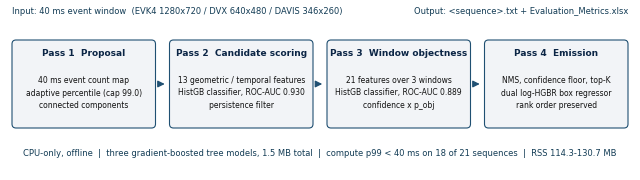
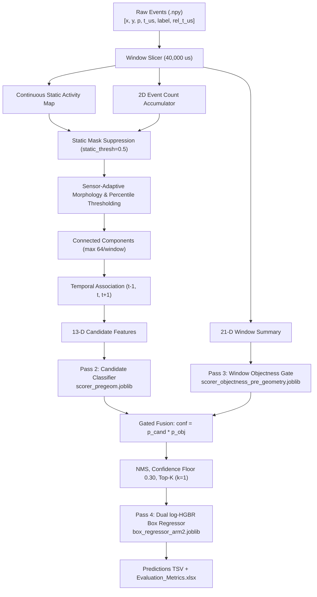
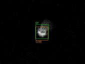

# OrbitSight — Neuromorphic Event-Based RSO Detection and Tracking

[](https://www.python.org/downloads/release/python-3110/)
[](https://opensource.org/licenses/MIT)
[](#benchmark-performance)
[](#real-time-performance)
[](#docker-submission-container)

**OrbitSight** detects and tracks resident space objects (RSOs) — satellites and orbital debris in LEO, MEO and GEO — in neuromorphic event-camera recordings from the Abu Dhabi Quantum Optical Ground Station's 0.8 m telescope. It runs on CPU, fully offline, with no neural network.

> **Naming.** The system is **OrbitSight**. This repository is named `OrbitAI` because that is the registered team name for the TII OrbitSight Challenge. Both names refer to the same artifact.

Submitted as a self-contained Docker image for the **TII OrbitSight Challenge** (Technology Innovation Institute, Propulsion and Space Research Center, Abu Dhabi).

---

## Headline results

Produced by the submitted container running offline across all 21 dataset sequences, and independently verified against the challenge's own `evaluate.py`.

| Split | mAP@0.5 | Precision | Recall | F1 | TP | FP | FN |
|---|---|---|---|---|---|---|---|
| **All 21 sequences** | **0.284406** | 0.623120 | 0.472327 | 0.537345 | 10,565 | 6,390 | 11,803 |
| Train (17, used for selection) | 0.258616 | 0.580217 | 0.454551 | 0.509754 | 6,951 | 5,029 | 8,341 |
| **Test (4, derived by subtraction)** | **0.394014** | 0.726432 | 0.510740 | 0.599784 | 3,614 | 1,361 | 3,462 |

Test-split figures are derived by subtracting the train-17 aggregate from the all-21 aggregate. The four test sequences were never used to select a configuration.

**Verification.** Precision, recall, F1 and the TP/FP/FN counts match `evaluate.py` exactly at absolute difference 0. mAP matches to **5.55e-17**, the limit of double-precision representation.

---

## The problem

Space Domain Awareness requires detecting faint, fast-moving objects against star fields. Frame-based telescopes suffer motion blur, dynamic-range saturation and blind spots during high-speed transits. Event cameras measure per-pixel asynchronous brightness changes at microsecond resolution with >120 dB dynamic range — but processing their output for space surveillance is hard for four reasons:

1. **Extreme background clutter.** Atmospheric turbulence, hot pixels and starfields generate enormous non-target event volume.
2. **Wide target velocity range.** Angular velocities span sub-pixel drift to tens of pixels per millisecond.
3. **Sensor heterogeneity.** Spatial resolution ranges from 346×260 to 1280×720, with different sensitivity and noise profiles.
4. **Streaming latency budget.** Per-window compute must fit inside the window arrival rate without unbounded buffering.

The core difficulty is not classification capacity. It is **ranking a very small number of true detections above a very large number of plausible noise components**, under a strict IoU ≥ 0.5 requirement, in real time, on CPU.

---

## Architecture



Four passes over each 40 ms event window:

**Pass 1 — proposal.** Events are accumulated into a 2D count map. Adaptive percentile thresholding escalates with window density (capped at 99.0) so bright frames do not flood the component stage. `cv2.connectedComponentsWithStats` yields components, ranked by event count and truncated at 64 per window; oversized components are re-thresholded and split. A continuous static-source map — the fraction of windows in which each pixel is active — suppresses stars and hot pixels.

**Pass 2 — candidate scoring.** Candidates are matched to the previous and next windows by centroid distance to produce a persistence count; single-window candidates are dropped. Thirteen features per candidate feed a `HistGradientBoostingClassifier` trained on **944,504 candidates** (6,977 positives, 937,527 negatives), validation **ROC-AUC 0.930**.

**Pass 3 — window objectness.** A 21-dimensional feature vector spanning the previous, current and next windows drives a second classifier estimating whether a window contains a real object at all. Candidate confidence is multiplied by this probability. Validation **ROC-AUC 0.889**, **PR-AUC 0.921** against a 0.60 trivial baseline — a 1.53× lift on the validation positive rate.

**Pass 4 — emission and box regression.** Per-window NMS, confidence floor, top-K selection, then a dual `HistGradientBoostingRegressor` predicting log-width and log-height, then exponentiation and per-sensor clamping.



### Why no neural network

Three gradient-boosted tree models totalling **1,496,897 bytes** (~1.5 MB) with eight pinned dependencies, no GPU and no network. Cold start is sub-second. On the stated evaluation hardware — Intel i9-12900H, 32 GB RAM, Ubuntu, CPU-only, offline — this is a deployable configuration rather than a research prototype awaiting accelerators.

### The central design decision

An earlier attempt optimised box geometry **upstream**, before scoring. Training labels for both classifiers are assigned by `IoU >= 0.5` computed *using the configured box size*, so changing box geometry changes which candidates are labelled positive. Recall rose and mAP fell: `0.155493` → `0.146340`.

The shipped design applies regression **after** ranking is finalised. Centroids, timestamps, confidences and rank order are preserved bit-for-bit; only width and height change. This is verifiable rather than asserted: **total detections are invariant at 16,955** before and after regression, so the regressor cannot have altered any ranking decision.

---

## Benchmark performance

### Box-sizing ablation (17 training sequences)

An oracle profiler substituting ground-truth box dimensions at fixed ranking established the achievable headroom before any model was built.

| Arm | Box sizing | mAP@0.5 | TP | FP | Upgrades | Downgrades |
|---|---|---|---|---|---|---|
| 0 | Heuristic extents (control) | 0.165103 | 5,060 | 6,920 | — | — |
| 1 | Least squares | 0.113964 | 5,554 | 6,426 | 1,581 | 1,087 |
| **2** | **Dual log-HGBR (shipped)** | **0.258616** | 6,951 | 5,029 | 2,302 | 411 |
| — | Oracle (ground-truth dimensions) | 0.318067 | 8,426 | 3,554 | 3,398 | 32 |

Arm 2 captures **61.1%** of the available oracle gap, a **+49.1%** improvement in all-21 mAP over the pre-regressor configuration (`0.190765`).

**Arm 1 is retained as a published negative result.** It raised precision, recall and F1 yet *reduced* mAP: shrinking boxes toward correct average dimensions without correcting centroid offset pushed 1,087 detections from IoU 0.50–0.55 down to 0.40–0.49, and those losses fell on higher-ranked detections than the gains. Rank-weighted metrics penalise this; count-based metrics do not.

Validation MAE in log-pixel space is 0.284 (width) and 0.297 (height) — 2.41 / 2.67 px on DAVIS.

### Per-sensor effect of box regression

| Sensor | Resolution | mAP before | mAP after | Change |
|---|---|---|---|---|
| EVK4 | 1280×720 | 0.612170 | 0.770544 | +25.9% |
| DVXplorer | 640×480 | 0.121921 | 0.225114 | +84.6% |
| DAVIS346 | 346×260 | 0.152401 | 0.228126 | +49.7% |

The EVK4 regressor head had **no validation sequences in the holdout**. That makes the EVK4 figure the least independently supported number in this repository, and it is stated here rather than omitted.

### Generalisation

The regressor converts false positives into true positives at nearly identical rates on data it was selected on and data it was not:

- Training split: 1,891 of 11,980 detections converted — **15.8%**
- Test split: 797 of 4,975 detections converted — **16.0%**
- Net: **+2,688 true positives** at a constant 16,955 total detections

The gain is largest where the baseline was weakest. On the ten sparse sequences (≤43 ground-truth boxes) mAP rises `0.100600` → `0.226600` (**+125.2%**); on the seven dense sequences `0.257257` → `0.304353` (+18.3%). These reconcile to the reported training mAP: (10 × 0.226600 + 7 × 0.304353) / 17 = **0.258616**.

### Regenerating per-sequence breakdowns

Per-sequence AP@0.5 and per-sequence latency tables are not reproduced here because they change with every configuration. Regenerate them from the shipped configuration:

```bash
python -m src.scoreboard --split train --pred-dir predictions --tag current
python -m src.latency_bench --dataset-dir ../OrbitSight_Dataset/Training_sets --config config.yaml --reps 5 --warmup-windows 20
```

---

## Real-time performance

Measured with a dedicated streaming benchmark timing the **full** per-window pipeline — proposal, feature extraction, both classifiers, NMS, confidence gating, top-K and box regression — over five independent repetitions, excluding 20 warmup windows per sequence.

| Compute p99 per window | Sequences |
|---|---|
| < 40 ms | **18 of 21** (nominal) |
| < 40 ms, excluding runs with σ > 25% of mean | **17 of 21** |
| < 40 ms, training split | **15 of 17**, up from 6 of 17 |

Best case is **14.99 ± 0.1 ms** (`DAVIS_Filtered_NOAA6`). Three sequences exceed the budget:

| Sequence | Compute p99 | Cause |
|---|---|---|
| `DVX_NOAA6_11416` | 84.67 ms | Densest stream, 22M raw events |
| `EVK4_mag7.3` | 77.76 ms | Highest resolution; worst case in every measurement taken |
| `EVK4_mag5.2` | 58.73 ms | Highest resolution |

**Disclosure.** The 6-of-17 → 15-of-17 improvement is attributable to replacing a per-window-materialising static-source map with a constant-memory accumulator — **not** to the box regressor, whose marginal cost is two vectorised `predict()` calls per sequence. Total container wall clock is 48.08 min (2,885.18 s), higher than the 23.26 min baseline: the constant-memory map trades total throughput for bounded memory and improved tail latency. Since the challenge scores per-window latency and imposes no wall-clock limit, we consider this the correct trade.

**Latency semantics.** With one window of lookahead, end-to-end latency is one 40 ms window period plus compute. We report compute p99 because it determines whether the system keeps pace with the sensor; the window period is inherent to the formulation.

**Run invariants.** 143,750 windows processed, 16,955 predictions emitted, 22,368 ground-truth boxes, resident memory 114.3–130.7 MB across all 21 sequences.

---

## Causal-variant ablation

To quantify the value of the disclosed 1-window lookahead, a strictly causal variant was evaluated across all 17 training sequences with every forward-looking feature zeroed (`t+1` displacement, forward speed, future window objectness).

| Metric | Reference config (mc=2000) | Causal variant | Δ |
|---|---|---|---|
| Overall train mAP | 0.163628 | 0.137223 | **−0.026405 (−16.1%)** |
| Sparse track mAP (≤43 GT) | 0.098205 | 0.051086 | **−0.047119 (−48.0%)** |
| Dense track mAP (>43 GT) | 0.257091 | 0.260275 | +0.003184 (+1.2%) |
| Precision | 0.422441 | 0.416869 | −0.005572 |
| Recall | 0.330892 | 0.337431 | +0.006539 |
| F1 | 0.371104 | 0.372967 | +0.001863 |

*This ablation was run against a pre-box-regressor reference configuration measuring 0.163628, not against the shipped 0.258616. Absolute values are therefore historical; the relative deltas are what the ablation establishes.*

**Finding.** Removing the lookahead costs **48.0% of sparse-track mAP** — equivalently, the 1-window lookahead delivers **+92.2% relative mAP on sparse sequences**. Dense sequences are unaffected, because a continuously visible target does not need future context.

---

## Detection example



EVK4 window, cropped. Green: ground truth. Orange: prediction with confidence and track ID. Rendered by `src/visualize.py`, which ships inside the submitted container.

---

## 13-dimensional candidate features

For each candidate bounding box:

| # | Feature | Meaning |
|---|---|---|
| 1 | `events` | Total events enclosed by the box |
| 2 | `density` | Local event density (events / area) |
| 3 | `area` | Box footprint in pixels (w × h) |
| 4 | `extent_w` | Box width |
| 5 | `extent_h` | Box height |
| 6 | `aspect` | max(w,h) / max(min(w,h), 1.0) |
| 7 | `hits` | Temporal persistence count across adjacent windows (1–3) |
| 8 | `disp_prev` | Distance to nearest candidate at t−1 |
| 9 | `disp_next` | Distance to nearest candidate at t+1 |
| 10 | `speed` | Mean displacement, ½(disp_prev + disp_next) |
| 11 | `dir_consistency` | Cosine similarity between successive trajectory vectors |
| 12 | `static_frac` | Background activity frequency at the box centroid |
| 13 | `local_bg` | Background event density in a 4-px dilated halo |

---

## Repository structure

```
├── config.yaml                 # Shipped pipeline configuration (global + per-sensor)
├── Dockerfile                  # Offline submission container definition
├── run.sh                      # Container entrypoint
├── requirements.txt            # Eight pinned runtime dependencies
├── AGENTS.md                   # Operating protocol and validation rules
├── PROPOSAL.md                 # Technical proposal source
├── models/
│   ├── scorer_pregeom.joblib                   # Pass 2 candidate classifier (359,304 B)
│   ├── scorer_objectness_pre_geometry.joblib   # Pass 3 window objectness gate (525,648 B)
│   ├── box_regressor_arm2.joblib               # Pass 4 dual log-HGBR regressor (611,945 B)
│   ├── scorer.joblib                           # Superseded; not referenced by config.yaml
│   └── model_structure.json                    # Model metadata and hyperparameters
├── experiments/
│   ├── CONFIG_LEDGER.md        # Every configuration evaluated, with commit SHA
│   ├── release_notes_v1.0.md   # Submission artifact provenance
│   ├── convert_pdf.py          # PROPOSAL.md -> HTML
│   ├── inspect_pdf.ps1         # HTML -> PDF with layout gates
│   ├── make_fig2.py            # Architecture diagram generator
│   └── frames/                 # Figures used by the proposal and this README
└── src/
    ├── common.py               # Event I/O, resolution inference, window slicing
    ├── detector.py             # Morphology, percentile filtering, connected components
    ├── static_map.py           # Continuous background activity map
    ├── features.py             # Vectorized 13-D candidate feature extraction
    ├── nms.py                  # IoU-based non-maximum suppression
    ├── tracker.py              # Multi-window track association and ID maintenance
    ├── pipeline.py             # Streaming processing engine
    ├── infer.py                # Batch dataset CLI inference and latency logging
    ├── metrics.py              # Canonical IoU and precision-recall metrics
    ├── scoreboard.py           # Authoritative mAP@0.5 evaluation suite
    ├── make_report.py          # Submission Excel metrics compiler
    ├── report_xlsx.py          # Formatted XLSX writer
    ├── validate_predictions.py # Prediction schema and coordinate validator
    ├── visualize.py            # Headless annotated video renderer
    ├── latency_bench.py        # Streaming per-window latency benchmark
    ├── train_scorer.py         # Pass 2 classifier training
    ├── train_box_regressor.py  # Pass 4 regressor training
    ├── train_reranker.py       # Track association model training
    ├── eval_box_arms.py        # Four-arm box-sizing ablation driver
    ├── oracle_boxsize.py       # Ground-truth-dimension oracle profiler
    ├── box_ceiling.py          # Box-geometry upper-bound analysis
    ├── oracle_recall.py        # Multi-stage upper-bound recall profiler
    ├── ablation_causal.py      # Causal (zero-lookahead) ablation suite
    ├── component_rank.py       # Connected component rank profiling
    ├── gt_occupancy.py         # Ground-truth window occupancy profiler
    ├── gt_census.py            # Ground-truth box census
    ├── analyze_gt.py           # Ground-truth distribution analysis
    ├── diagnose_recall.py      # Recall loss attribution
    ├── debug_dvx.py            # DVXplorer-specific diagnostics
    ├── tune_threshold.py       # Confidence threshold tuning
    ├── filter_preds.py         # Post-hoc confidence and top-K filter
    ├── sweep.py                # Detector parameter sweep engine
    ├── measure_interleaved_resizer.py  # Regressor batching cost measurement
    ├── verify_batched_resizer.py       # Regressor batching equivalence check
    ├── test_config_plumbing.py         # Config propagation tests
    ├── test_feature_parity.py          # Feature extraction parity tests
    └── test_pipeline_parity.py         # Research vs container parity tests
```

---

## Quick start

```bash
git clone https://github.com/swarajladke/OrbitAI.git
cd OrbitAI

python -m venv .venv
source .venv/bin/activate        # Linux/macOS
# .venv\Scripts\activate         # Windows

pip install -r requirements.txt
```

**Batch inference**

```bash
python -m src.infer --input_dir ../OrbitSight_Dataset/Training_sets --output_dir predictions --config config.yaml
```

Each sequence emits nine tab-separated fields with a header row:

```tsv
sequence_id	window_start_timestamp_us	window_end_timestamp_us	center_x	center_y	width	height	class_id	confidence
2025_12_23_21_12_28_EVK4_mag5.2	1734988346000000	1734988346040000	320.0	240.0	52	56	0	0.8452
```

Field names 4–7 are `center_x`, `center_y`, `width`, `height` because the official `evaluate.py` reads them with `csv.DictReader` and requires exactly those keys. All nine fields appear in the order the challenge specifies.

**Evaluate**

```bash
python -m src.scoreboard --split train --pred-dir predictions --tag submission-v1
```

**Benchmark latency**

```bash
python -m src.latency_bench --dataset-dir ../OrbitSight_Dataset/Training_sets --config config.yaml --reps 5 --warmup-windows 20
```

**Render video**

```bash
python -m src.visualize --npy path/to/events.npy --pred path/to/pred.txt --gt path/to/gt.txt --out video.mp4 --fps 25 --max-windows 300
```

---

## Docker submission container

```bash
docker build -t orbitsight:latest .

docker run --rm --network none \
  -v /absolute/path/to/OrbitSight_Dataset:/OrbitSight_dataset:ro \
  -v /absolute/path/to/work:/work \
  orbitsight:latest
```

`run.sh` defaults to `TEAM_NAME=OrbitAI` and requires no environment variables, because the evaluation harness passes none. Output goes to `/work/OrbitAI/<DDMMYYYY>` and contains:

- **63 `.txt` prediction files** — 21 sequences × 3 filename conventions (`<seq>.txt`, `<seq>_pred.txt`, `<seq>_bb_windows_40ms.txt`), where `<seq>.txt` is the challenge-conformant name
- **`Evaluation_Metrics.xlsx`** (7,341 B)

Mirror directories `/work/orbitai`, `/work/orbitsight` and `/work/OrbitSight` are also written as a defensive measure against team-name casing mismatch.

### Verified container execution

Across all 21 sequences (143,750 windows):

- **Offline**: executed with `--network none`, exit code `0`
- **Schema**: all 63 files pass `src.validate_predictions` with zero schema or coordinate errors
- **No-ground-truth robustness**: verified on dataset mounts with `*_bb_windows_40ms.txt` removed; `make_report` still writes a valid `Evaluation_Metrics.xlsx` rather than crashing, which matches the actual offline evaluation condition
- **Determinism**: six end-to-end runs produced identical detection counts; the three runs of the shipped configuration produced identical mAP to six decimal places
- **Harness parity**: container prediction counts are byte-identical to the research scoreboard run

### Submitted artifact

| Property | Value |
|---|---|
| Release tag | `v1.0-submission` |
| Archive | 188,539,903 bytes gzipped / 582,660,096 bytes raw |
| SHA-256 | `7bb765b28dd8e600c4f82969fadfd1449a3b4c57f5cbd76749bb2e323c12c722` |

---

## Measurement protocol

Every number in this README came from a run whose output was pasted verbatim, not summarised. The standing rules:

- **Arm 0 is retained permanently as a do-nothing control** in every box-sizing comparison.
- **Failed arms are published, not deleted.** Arm 1 lost mAP and remains in the ablation table above.
- **Configuration selection used the 17 training sequences only.** Test-split figures are derived by subtraction.
- **Every configuration evaluated is recorded** in `experiments/CONFIG_LEDGER.md` with its commit SHA.
- **Run-to-run container timing is never quoted as a guarantee.** Per-window means have ranged from 9.65 to 25.50 ms across six runs; only the p99 distribution is reported.

---

## Event file format

Input files (`*_labeled_events.npy`) are structured 2D NumPy arrays:

| Column | Field | Units |
|---|---|---|
| 0 | `x` | pixels |
| 1 | `y` | pixels |
| 2 | `polarity` | −1/+1 or 0/1 |
| 3 | `timestamp_us` | absolute microseconds |
| 4 | `label` | 0 = noise, 1 = target |
| 5 | `relative_timestamp_us` | window-relative microseconds |

`class_id` is `0` for every prediction. The challenge defines a single RSO class, and we do not infer a taxonomy we cannot validate.

---

## License

MIT.
