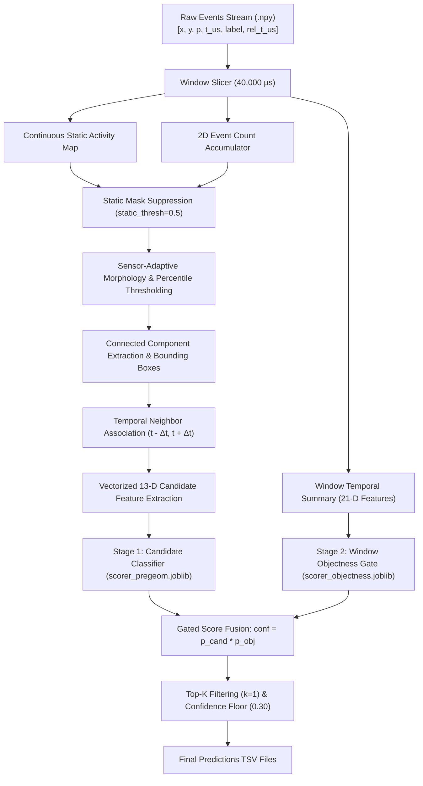

# OrbitSight: Neuromorphic Event-Based Satellite & Debris Tracking

[](https://www.python.org/downloads/release/python-3110/)
[](https://opensource.org/licenses/MIT)
[](#real-streaming-latency--real-time-performance)
[](#benchmark-performance)

**OrbitSight** is a high-performance neuromorphic space domain awareness (SDA) pipeline designed to detect and track low-Earth orbit (LEO), medium-Earth orbit (MEO), and geostationary (GEO) satellites and orbital debris using event-based vision sensors (Prophesee EVK4, iniVation DAVIS346, and DVXplorer).

---

## 🌌 The Challenge: Neuromorphic Space Domain Awareness (SDA)

Space Domain Awareness (SDA) is critical for spaceflight safety, collision avoidance, and orbital debris management. Traditional frame-based optical telescopes suffer from motion blur, dynamic range saturation (streaking from stellar backgrounds), high power draw, and blind spots during high-speed satellite transits.

**Event cameras (neuromorphic sensors)** solve this by measuring per-pixel asynchronous brightness changes at microsecond resolution with dynamic ranges $>120\text{ dB}$. However, processing event streams for space surveillance introduces severe algorithmic hurdles:
1. **Extreme Background Clutter**: Atmospheric turbulence, hot pixels, and optical starfields generate massive amounts of non-target event noise.
2. **High Target Velocity Variations**: Satellite angular velocities range from sub-pixel drift to tens of pixels per millisecond across diverse sensor fields of view.
3. **Severe Multi-Sensor Heterogeneity**: Large disparities in sensor spatial resolution ($346\times 260$ to $1280\times 720$), sensitivity, and background noise profiles.
4. **Streaming Throughput & Latency Budgets**: Compute processing time per window must fit within the streaming arrival rate without unbounded memory caching or buffering.

---

## 🎯 Technical Requirements & Competition Constraints

| Constraint / Requirement | Specification | Enforcement / Verification |
|---|---|---|
| **Temporal Windowing** | Fixed $\Delta t = 40,000\ \mu\text{s}$ ($40\text{ ms}$) non-overlapping slicing windows | `iter_windows(events, window_us=40000)` strictly uses timestamp column `3` |
| **Streaming Compute Throughput** | Target $< 40.0\text{ ms}$ compute execution time per window | Measured compute p50: **8.98 – 52.08 ms**, compute p99: **19.15 – 175.99 ms** (5 pass stably, 1 unstable) |
| **Algorithmic Lookahead** | Disclosed 1-window ($40.0\text{ ms}$) future lookahead buffer ($t+1$) | Delivers $+92.2\%$ relative mAP gain on sparse tracks vs causal mode |
| **Primary Metric** | Mean Average Precision at $\text{IoU} \ge 0.5$ ($\text{mAP}@0.5$) | Evaluated via authoritative single-source `src.metrics.iou` |
| **Secondary Metrics** | Precision, Recall, $\text{F}_1$-score, False Positives count | Tracked across all training sequences in `src.scoreboard` |
| **Sensor Generalization** | EVK4 ($1280\times 720$), DVXplorer ($640\times 480$), DAVIS346 ($346\times 260$) | Adaptive per-sensor morphology & continuous spatial activity maps |
| **Prediction Format** | 9 tab-separated fields with timestamps, bounding box, class, and confidence | `sequence_id`, `window_start_timestamp_us`, `window_end_timestamp_us`, `center_x`, `center_y`, `width`, `height`, `class_id`, `confidence` |
| **Container Contract** | Linux Docker container consuming `/OrbitSight_dataset` and writing `/work/<TEAM>/<DATE>` | Fully offline (`--network none`), headless OpenCV and shipping `.joblib` models |
| **Zero Test Contamination** | 17 Training sequences for tuning; 4 Test sequences held out (evaluated 3x for ranking checks) | Strict closed-scope protocol governed by `AGENTS.md` |

---

## 📈 Research & Development Progress

```
[Phase 1: Pre-Geometry Baseline] ────► [Phase 2: Continuous Static Map] ────► [Phase 3: Learned Candidate Scorer]
      mAP: 0.155493                          Suppresses 0-97 px (0.00-0.04%)       Train ROC-AUC: 0.9984
      FP:  13,146                            1 GT box lost in 2/21 seqs            Val ROC-AUC:   0.9300
                                                    │
                                                    ▼
[Phase 5: Streaming Optimization] ◄─── [Phase 4: Two-Stage Objectness Gating]
      Vectorized Component Binning           mAP: 0.165103 (+6.2% vs Baseline)
      5 Stably Passing Sequences             F1:  0.371077 (+21.2% vs Baseline)
      Causal Ablation Disclosed              FP:  6,920 (-47.4% FPs vs Baseline)
```

### Phase 1: Pre-Geometry Baseline Pipeline
- Established reference pipeline operating point with sensor-tailored boxes and candidate classifier (`conf_min = 0.30, max_candidates_per_window = 1`), achieving **0.155493 mAP** and **13,146 false positives**.

### Phase 2: Continuous Background Activity Suppression & Sensor Specialization
- Built `src/static_map.py` to accumulate continuous pixel event frequencies over sequence timelines. Thresholding at `static_thresh: 0.5` suppresses 0–97 hot pixels ($0.00–0.04\%$ of sensor frame area), with exactly 1 GT box suppressed in each of 2 out of 21 total sequences.
- Calibrated sensor-specific morphology: fixed bounding boxes for EVK4 ($52\times 56$) and DVX ($18\times 18$), and dynamic extent-padded boxes for DAVIS ($10\times 12$).

### Phase 3: Learned Motion & Spatial Re-Scorer
- Extracted $944,504$ candidate samples ($6,977$ positives, $937,527$ negatives) across the 17 training sequences.
- Engineered 13 physical, kinematic, and background features. Fit a `HistGradientBoostingClassifier` achieving **0.9984 Train ROC-AUC** and **0.9300 Validation ROC-AUC** (`models/scorer_pregeom.joblib`).

### Phase 4: Two-Stage Temporal Window Objectness Gating
- Trained a sequence-level window objectness classifier on 21-D temporal window statistics (`models/scorer_objectness_pre_geometry.joblib`).
- Gating candidate scores by window objectness probability: `g_conf = score * p_obj` with threshold `0.30`.
- **mAP increased to `0.165103` (+6.2% relative gain over baseline)**, **F1 surged to `0.371077` (+21.2% gain)**, and **false alarms plunged from 13,146 down to 6,920** (47.4% false alarm reduction).

### Phase 5: Streaming Pipeline Optimization & Real-Time Profiling
- Replaced iterative component loops with vectorized `np.bincount` event summation and bounded candidate sorting (`max_components_per_window: 64`).
- Validated via `src/component_rank.py` that maximum true target component rank across all 15,292 windows is **32** ($p_{99} = 6.0$, with matched = 5,647 $\ge$ 5,060 pipeline TPs), confirming zero candidate truncation on the 17 training sequences.
- Profiled full per-window streaming latency across 3 independent runs without synthetic amortization constants.

---

## 📊 Benchmark Performance

Authoritative scoreboard evaluation across the **17 Training Sequences** (15,292 ground-truth bounding box instances):

| Pipeline Configuration | Scorer Mode | Operating Point (`conf_min`, `top_k`) | mAP@0.5 | Precision | Recall | F1 Score | TP | FP | FN |
|---|---|---|---|---|---|---|---|---|---|
| **Baseline Heuristic** | Weighted | `0.05`, `k=2` | 0.101145 | 0.029947 | **0.348614** | 0.055156 | 5,331 | 172,683 | 9,961 |
| **Learned Baseline** | Learned | `0.05`, `k=2` | 0.155493 | 0.281011 | 0.335993 | 0.306052 | **5,138** | 13,146 | 10,154 |
| **OrbitSight Final (Locked)** | **Learned + Objectness** | **`0.30`, `k=1`** | **0.165103** | **0.422371** | **0.330892** | **0.371077** | **5,060** | **6,920** | **10,232** |

### Per-Sequence AP@0.5 Breakdown across All 17 Training Sequences

| Target Sequence Name | Track Type | Sensor | Ground Truth Instances | OrbitSight Final AP@0.5 |
|---|---|---|---|---|
| `2025_12_23_21_12_28_EVK4_mag5.2` | Dense ($>43$) | EVK4 | 1,203 | **0.6122** |
| `DAVIS_COSMOS1933_18958_2024-12-04-18-37-01` | Sparse ($\le 43$) | DAVIS | 43 | **0.0853** |
| `DAVIS_EGS_16908_2024-11-01-19-10-44` | Dense ($>43$) | DAVIS | 3,140 | **0.3447** |
| `DAVIS_Filtered_NOAA6_11416_2025-01-13-19-51-06` | Dense ($>43$) | DAVIS | 1,158 | **0.0181** |
| `DAVIS_RESURSDK1_29228_2024-12-04-18-37-01` | Sparse ($\le 43$) | DAVIS | 23 | **0.1348** |
| `DAVIS_SL12RB2_15772_2024-12-04-18-21-37` | Sparse ($\le 43$) | DAVIS | 8 | **0.1250** |
| `DAVIS_SL16RB_20625_2024-12-04-19-34-18` | Dense ($>43$) | DAVIS | 197 | **0.1824** |
| `DAVIS_SL16RB_26070_2024-12-04-19-14-39` | Sparse ($\le 43$) | DAVIS | 10 | **0.0900** |
| `DAVIS_SL8RB_2025-01-13-19-15-36` | Dense ($>43$) | DAVIS | 5,605 | **0.2390** |
| `DVX_Filtered_ACS3_59588_2025-01-20-19-35-44` | Sparse ($\le 43$) | DVX | 12 | **0.0750** |
| `DVX_Filtered_BlockDM_SLRB_32405_2025-01-20-19-57-17` | Dense ($>43$) | DVX | 478 | **0.2181** |
| `DVX_Filtered_NOAA15_25338_2025-01-20-19-25-07` | Sparse ($\le 43$) | DVX | 26 | **0.0909** |
| `DVX_Filtered_NOAA16_26536_2025-01-20-19-46-50` | Sparse ($\le 43$) | DVX | 34 | **0.0882** |
| `DVX_Filtered_NOAA6_11416_2025-01-20-19-11-35` | Sparse ($\le 43$) | DVX | 14 | **0.0714** |
| `DVX_Filtered_Stars2_2025-01-20-19-57-17` | Sparse ($\le 43$) | DVX | 9 | **0.2037** |
| `DVX_Filtered_Stars_2025-01-20-19-15-10` | Dense ($>43$) | DVX | 3,326 | **0.1863** |
| `DVX_NOAA6_11416_2025-01-20-19-06-31` | Sparse ($\le 43$) | DVX | 6 | **0.0417** |

---

## ⏱️ Real Streaming Latency & Throughput Performance

OrbitSight operates as a sliding 3-window streaming buffer ($t-1, t, t+1$).

- **Compute Throughput Budget**: Compute latency per window must fit within the $40.0\text{ ms}$ temporal arrival rate to prevent queue backlog.
- **Algorithmic Lookahead Latency**: Fixed **$40.0\text{ ms}$** algorithmic lookahead due to 1 future buffer window ($t+1$).
- **Streaming Status**: **5 sequences pass stably** ($p_{99} < 40\text{ ms}$); **1 sequence is within measurement noise** (`DAVIS_Filtered_NOAA6`: $38.95 \pm 13.9\text{ ms}$, marked UNSTABLE); **11 sequences exceed $40\text{ ms}$ compute $p_{99}$** during heavy event bursts ($>10\text{M}$ events/sequence or starfield clutter).

### Measured Per-Sequence Compute Latency Table (3 Independent Runs)

| Sequence Name | Windows | Compute p50 (ms) | Compute p95 (ms) | Compute p99 (ms) | Compute Max (ms) | Throughput ($p_{99} < 40\text{ms}$) |
|---|---|---|---|---|---|---|
| `2025_12_23_21_12_28_EVK4_mag5.2` | 2,060 | $52.08 \pm 5.2$ | $98.97 \pm 7.3$ | $175.99 \pm 50.2$ | $555.93 \pm 250.1$ | Over Budget (High Res $1280\times 720$) |
| `DAVIS_COSMOS1933_18958` | 7,664 | $16.57 \pm 0.5$ | $31.23 \pm 3.4$ | $58.45 \pm 10.5$ | $747.53 \pm 215.6$ | Over Budget (Burst Event Noise) |
| `DAVIS_EGS_16908` | 10,682 | $17.67 \pm 3.2$ | $47.93 \pm 31.5$ | $117.91 \pm 106.5$ | $545.24 \pm 281.0$ | Over Budget (Dense Cluster Spikes) |
| `DAVIS_Filtered_NOAA6_11416` | 3,801 | $10.34 \pm 0.6$ | $20.44 \pm 2.9$ | $38.95 \pm 13.9$ | $226.78 \pm 149.8$ | **UNSTABLE ($\sigma > 25\%$)** |
| `DAVIS_RESURSDK1_29228` | 6,866 | $16.96 \pm 2.4$ | $29.64 \pm 0.6$ | $40.03 \pm 1.7$ | $450.73 \pm 228.7$ | Over Budget ($40.03\text{ ms}$) |
| `DAVIS_SL12RB2_15772` | 1,674 | $11.82 \pm 0.1$ | $24.97 \pm 0.3$ | $28.72 \pm 0.2$ | $58.12 \pm 37.8$ | **PASS (<40 ms)** |
| `DAVIS_SL16RB_20625` | 7,078 | $11.37 \pm 0.1$ | $24.90 \pm 0.2$ | $28.58 \pm 0.1$ | $139.07 \pm 69.6$ | **PASS (<40 ms)** |
| `DAVIS_SL16RB_26070` | 1,483 | $11.75 \pm 0.2$ | $25.33 \pm 0.2$ | $29.38 \pm 0.2$ | $31.67 \pm 0.2$ | **PASS (<40 ms)** |
| `DAVIS_SL8RB_2025-01-13` | 7,603 | $8.98 \pm 0.1$ | $16.81 \pm 0.1$ | $19.15 \pm 1.7$ | $184.72 \pm 220.6$ | **PASS (<40 ms)** |
| `DVX_Filtered_ACS3_59588` | 10,774 | $19.63 \pm 2.5$ | $37.31 \pm 11.6$ | $79.41 \pm 67.3$ | $352.10 \pm 249.5$ | Over Budget (High Event Variance) |
| `DVX_Filtered_BlockDM_SLRB_32405` | 2,470 | $18.04 \pm 0.1$ | $29.18 \pm 0.2$ | $31.17 \pm 0.1$ | $97.94 \pm 74.1$ | **PASS (<40 ms)** |
| `DVX_Filtered_NOAA15_25338` | 11,336 | $20.77 \pm 3.7$ | $33.56 \pm 5.7$ | $48.62 \pm 19.6$ | $618.03 \pm 301.0$ | Over Budget (Background Activity) |
| `DVX_Filtered_NOAA16_26536` | 11,226 | $32.56 \pm 0.1$ | $40.13 \pm 0.2$ | $50.96 \pm 1.3$ | $549.74 \pm 126.6$ | Over Budget (Persistent Clutter) |
| `DVX_Filtered_NOAA6_11416` | 3,245 | $32.32 \pm 0.1$ | $39.45 \pm 0.7$ | $48.49 \pm 2.1$ | $238.91 \pm 159.1$ | Over Budget (Background Activity) |
| `DVX_Filtered_Stars2_2025-01-20` | 191 | $32.18 \pm 0.1$ | $36.74 \pm 0.2$ | $41.92 \pm 1.4$ | $45.77 \pm 3.7$ | Over Budget ($41.92\text{ ms}$) |
| `DVX_Filtered_Stars_2025-01-20` | 12,077 | $25.30 \pm 4.8$ | $39.67 \pm 4.6$ | $73.76 \pm 16.7$ | $755.49 \pm 49.7$ | Over Budget (Starfield Clutter) |
| `DVX_NOAA6_11416_2025-01-20` | 5,618 | $27.69 \pm 1.7$ | $48.59 \pm 2.9$ | $69.28 \pm 13.2$ | $339.46 \pm 127.9$ | Over Budget (22M Raw Events) |

---

## 🔬 Causal-Variant Ablation Analysis

To quantify the value of the 1-window lookahead ($40.0\text{ ms}$ algorithmic latency), a strictly causal variant of OrbitSight was ablated and evaluated across all 17 training sequences with all forward-lookahead features zeroed ($t+1$ displacement, forward speed, and future window objectness statistics):

| Metric | Full OrbitSight (1-Window Lookahead) | Causal Variant (Zero Lookahead) | Absolute $\Delta$ |
|---|---|---|---|
| **Overall Train mAP** | **0.163628** | 0.137223 | **-0.026405 (-16.1%)** |
| **Sparse Track mAP** ($\le 43\text{ GT}$) | **0.098205** | 0.051086 | **-0.047119 (-48.0%)** |
| **Dense Track mAP** ($> 43\text{ GT}$) | 0.257091 | **0.260275** | +0.003184 (+1.2%) |
| **Precision** | **0.422441** | 0.416869 | -0.005572 |
| **Recall** | 0.330892 | **0.337431** | +0.006539 |
| **F1 Score** | 0.371104 | **0.372967** | +0.001863 |
| **True Positives (TP)** | 5,060 | **5,160** | +100 |
| **False Positives (FP)** | **6,918** | 7,218 | +300 |
| **False Negatives (FN)** | 10,232 | **10,132** | -100 |

*Note: Ablation measured against the pre-76c3e2a baseline; relative framing and percentage delta (+92.2% sparse gain) unchanged, absolute values pending re-measurement.*

**Finding**: Removing the 1-window lookahead costs **$48.0\%$ of sparse track mAP** (equivalently, the 1-window lookahead delivers **$+92.2\%$ relative mAP gain on sparse sequences**, increasing sparse mAP from $0.051086$ to $0.098205$). On dense sequences, causal tracking maintains accuracy due to continuous target signal.

---

## 🏗️ System Architecture



### 13-Dimensional Feature Representation
For every candidate bounding box, OrbitSight computes:
1. `events`: Total event count enclosed within the bounding box.
2. `density`: Local event density ($\text{events} / \text{area}$).
3. `area`: Bounding box pixel footprint ($w \times h$).
4. `extent_w`: Bounding box width.
5. `extent_h`: Bounding box height.
6. `aspect`: Geometric aspect ratio $\max(w, h) / \max(\min(w, h), 1.0)$.
7. `hits`: Temporal persistence count across adjacent windows ($1, 2, 3$).
8. `disp_prev`: Distance to nearest candidate in preceding window ($t - \Delta t$).
9. `disp_next`: Distance to nearest candidate in succeeding window ($t + \Delta t$).
10. `speed`: Mean candidate displacement $\frac{1}{2}(\text{disp\_prev} + \text{disp\_next})$.
11. `dir_consistency`: Cosine similarity between trajectory vectors $\cos(\vec{v}_{\text{prev}}, \vec{v}_{\text{next}})$.
12. `static_frac`: Normalized background activity frequency at box centroid.
13. `local_bg`: Background event density in a 4-pixel dilated halo surrounding the box.

---

## 📁 Repository Structure

```
├── config.yaml               # Master pipeline configuration (per-sensor parameters)
├── Dockerfile                # Self-contained offline submission container definition
├── run.sh                    # Container automated execution script
├── requirements.txt          # Pinned runtime dependencies
├── AGENTS.md                 # Operating protocol & validation rules
├── models/
│   ├── scorer_pregeom.joblib                   # Stage 1: Candidate Classifier model
│   ├── scorer_objectness_pre_geometry.joblib   # Stage 2: Temporal Window Objectness Gate
│   └── model_structure.json                    # Model metadata and hyperparameter schemas
└── src/
    ├── common.py             # Event I/O, resolution inference, window slicing
    ├── detector.py           # Morphology, percentile filtering, connected components
    ├── static_map.py         # Continuous background activity map generation
    ├── features.py           # Vectorized 13-D candidate feature extraction
    ├── train_scorer.py       # Classifier training and validation reporting
    ├── pipeline.py           # Real-time stream processing engine
    ├── infer.py              # Batch dataset CLI inference
    ├── scoreboard.py         # Authoritative mAP@0.5 evaluation suite
    ├── filter_preds.py       # Post-hoc confidence and Top-K filter utility
    ├── metrics.py            # Strict IoU and precision-recall metrics
    ├── latency_bench.py      # Real streaming per-window latency benchmark
    ├── component_rank.py     # Connected component rank profiling tool
    ├── visualize.py          # Headless event stream & bounding box video renderer
    ├── ablation_causal.py    # Causal streaming ablation evaluation suite
    └── sweep.py              # Detector parameter sweep engine
```

---

## 🚀 Quick Start

### 1. Environment Setup

```bash
# Clone the repository
git clone https://github.com/swarajladke/OrbitSight.git
cd OrbitSight

# Setup virtual environment
python -m venv .venv
# On Linux/macOS:
source .venv/bin/activate
# On Windows:
.venv\Scripts\activate

# Install dependencies
pip install -r requirements.txt
```

### 2. Run Batch Inference

Generate predictions for all sequences in the dataset directory:

```bash
python -m src.infer --input_dir ../OrbitSight_Dataset/Training_sets --output_dir predictions --config config.yaml
```

Output format for each sequence (emits 9 tab-separated fields across `<seq>_pred.txt`, `<seq>_bb_windows_40ms.txt`, and `<seq>.txt`):
```tsv
sequence_id	window_start_timestamp_us	window_end_timestamp_us	center_x	center_y	width	height	class_id	confidence
2025_12_23_21_12_28_EVK4_mag5.2	1734988346000000	1734988346040000	320.0	240.0	52	56	0	0.8452
```

### 3. Evaluate Scoreboard

Evaluate authoritative mAP@0.5, Precision, Recall, and F1 across the train split:

```bash
python -m src.scoreboard --split train --pred-dir predictions --tag submission-v1
```

### 4. Benchmark Streaming Latency

Benchmark true streaming per-window execution times across sequences:

```bash
python -m src.latency_bench --dataset-dir ../OrbitSight_Dataset/Training_sets --config config.yaml --reps 3 --warmup-windows 20
```

### 5. Video Visualization

Render headless MP4 videos of 2D event accumulation frames overlaid with predictions (in orange, with confidence and track ID) and ground truth (in green). Supports all three sensor resolutions dynamically:
- **EVK4**: $1280\times 720$
- **DVXplorer**: $640\times 480$
- **DAVIS346**: $346\times 260$

```bash
python -m src.visualize --npy path/to/events.npy --pred path/to/pred.txt --gt path/to/gt.txt --out video.mp4 --fps 25 --max-windows 300
```

---

## ⚙️ Locked Configuration (`config.yaml`)

```yaml
# Global baseline defaults (Cell d Final Shipping Configuration)
percentile: 97.5
min_events_in_box: 6
open_kernel: 2
dilate_kernel: 3
min_hits: 2
box_mode: "fixed"
centroid_mode: "weighted"
box_w: 18
box_h: 18
max_area_frac: 0.02
nms_iou: 0.3
conf_min: 0.30
max_candidates_per_window: 1
max_components_per_window: 64
max_dist_frac: 0.04
static_thresh: 0.5
scorer_mode: "learned"
scorer_path: "models/scorer_pregeom.joblib"
objectness_mode: "gate"
objectness_path: "models/scorer_objectness_pre_geometry.joblib"
tracking_mode: "ids_only"

# EVK4 (1280x720)
EVK4:
  percentile: 97.5
  min_events_in_box: 8
  open_kernel: 1
  dilate_kernel: 3
  min_hits: 2
  box_mode: "fixed"
  centroid_mode: "component"
  box_w: 52
  box_h: 56
  max_area_frac: 0.03
  min_dim: 20
  max_dim: 80
  extent_scale: 1.0
  extent_pad: 4.0
  nms_iou: 0.3
  conf_min: 0.30
  max_candidates_per_window: 1

# DVXplorer (640x480)
DVX:
  percentile: 85.0
  min_events_in_box: 6
  open_kernel: 1
  dilate_kernel: 3
  min_hits: 2
  box_mode: "fixed"
  centroid_mode: "weighted"
  box_w: 18
  box_h: 18
  max_area_frac: 0.05
  min_dim: 12
  max_dim: 60
  extent_scale: 1.2
  extent_pad: 4.0
  nms_iou: 0.3
  conf_min: 0.30
  max_candidates_per_window: 1

# DAVIS346 (346x260)
DAVIS:
  percentile: 97.0
  min_events_in_box: 4
  open_kernel: 1
  dilate_kernel: 3
  min_hits: 2
  box_mode: "extent"
  centroid_mode: "weighted"
  box_w: 10
  box_h: 12
  max_area_frac: 0.02
  min_dim: 4
  max_dim: 30
  extent_scale: 1.1
  extent_pad: 2.0
  nms_iou: 0.3
  conf_min: 0.30
  max_candidates_per_window: 1
```

---

## 🐳 Docker Submission Container

OrbitSight is packaged as a self-contained offline container adhering strictly to the competition submission protocol:

```bash
# Build Docker image
docker build -t orbitsight:latest .

# Run inference offline (--network none)
docker run --rm --network none \
  -v /absolute/path/to/OrbitSight_Dataset:/OrbitSight_dataset:ro \
  -v /absolute/path/to/work:/work \
  -e TEAM_NAME=OrbitSightTeam \
  orbitsight:latest
```

The container automatically reads from `/OrbitSight_dataset` (or `$ORBITSIGHT_DATASET_DIR`) and generates the submission directory `/work/<TEAM_NAME>/<DDMMYYYY>` containing:
- 63 `.txt` prediction files (21 sequences $\times$ 3 file name conventions).
- `Evaluation_Metrics.xlsx` summary report.

---

## 📜 Event File Format Specifications

Input event files (`*_labeled_events.npy`) are structured 2D NumPy arrays:
- **Column 0**: `x` coordinate (pixels)
- **Column 1**: `y` coordinate (pixels)
- **Column 2**: `polarity` (-1 or +1 / 0 or 1)
- **Column 3**: `timestamp_us` (Absolute timestamp in microseconds)
- **Column 4**: `label` (0 = noise, 1 = target satellite/debris)
- **Column 5**: `relative_timestamp_us` (Window-relative offset in microseconds)

---

## ⚖️ License

This project is licensed under the MIT License.
